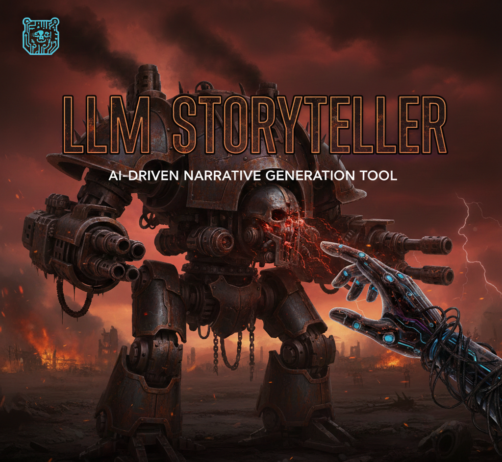

# LLM-Storytell

## General info

This README’s primary target audience is **AI agents working on this repository**.
It is also accurate for humans who enjoy clarity.




The system is pipeline-first and app-configured: a single core pipeline operates over different “apps” (content profiles) that define tone, context, structure, and output expectations.

It is designed to support **multiple content “apps”** (profiles), each with its own:

* Lore and world context
* Tone and narration rules
* Output length and structure
* Audio / voice / background style (v1.1+)

The committed example app is **example_app**; run with `--app example_app` to try the pipeline. It will not be the last.

---

## Design goals

The README intentionally avoids low-level mechanics; **`SPEC.md` is the source of truth** for execution details.

The system is explicitly designed to:

* Generate long-form content from short prompts
* Be **reproducible and inspectable**
* Be able to work with both extremely limited and over-supplied broader context
* Avoid hidden memory or conversational drift
* Persist *everything* to disk
* Be extended by configuration and content files, not code changes
* Be safe to operate via automated coding agents

Creativity is allowed. Ambiguity is not.

---

## Cursor IDE note (important)

This repository includes a `.cursor/` directory containing **project-level agent rules**.

If you are using Cursor:

* Do **not** delete or modify `.cursor/rules/`
* If human, read `CURSOR_WORKFLOW.md`
* These rules define the required task workflow, validation steps, and scope limits

If you are not using Cursor:

* Treat these rules as authoritative documentation of the intended agent workflow

---

## What this project is (and is not)

### This **is**

* A general-purpose **content generation pipeline**
* A deterministic orchestration of LLM calls
* A system for producing text, audio, and later video
* A framework for multiple content profiles (“apps”)

### This **is not**

* A chat interface
* An interactive storytelling engine
* A real-time or streaming generator
* A hosted service (yet)
* A creative writing assistant

This is infrastructure. Not vibes.

---

## Core concept: apps / profiles

An **app** defines *what kind of content* is being generated.

Each app provides:

* A lore bible
* Context snippets (locations, characters, etc.)
* Tone and narration rules
* Expected output length
* Audio and presentation defaults (future versions)

Apps may range from minimal configurations (e.g. a single lore file and a short prompt producing a one-page story) to extensive setups with large rotating context libraries and long-form outputs.

Example apps:

* `example_app` — minimal committed app under `apps/example_app/`; run with `--app example_app` to try the pipeline.
* `grim-narrator`
  60-minute bleak, depressive, slow-paced stories
* `toddler-bedtime` (future)
  10-minute lighthearted stories about cars, upbeat tone, calm voice
* others later

### MVP scope

* **example_app** (committed) exists; other apps are gitignored under `apps/`.
* Architecture assumes more will be added

---

## Context handling (MVP behavior)

For the active app (e.g. `example_app`), context lives under `apps/<app_name>/context/`:

* **Required:** The app’s **lore bible** (`apps/<app_name>/context/lore_bible.md`) must exist, and at least one character file in `apps/<app_name>/context/characters/*.md` must exist. If either is missing, the run fails early with a clear error.
* **Optional:** If `apps/<app_name>/context/locations/` has `.md` files, exactly one location is included (first alphabetically). If `apps/<app_name>/context/world/` has `.md` files, all are loaded in alphabetical order and folded into the lore bible with a visible separator; the list is stored in `selected_context.world_files`.
* Selection is **deterministic** (no randomness): location = first alphabetically, characters = first N (from app config or pipeline default) alphabetically. Selections are logged and persisted in `state.json` for reproducibility.

---

## How it works (intentionally high-level)

1. A short seed prompt is provided via CLI
2. The active app’s rules and context are loaded
3. A fixed multi-stage pipeline runs:
   * outline → (for each beat: section then summarize) → critic
4. All intermediate artifacts are persisted
5. A final script is produced
6. Later versions convert this into audio and video

Detailed mechanics live in `SPEC.md`.
README stays readable.

### LLM provider abstraction (v1.0)

All LLM calls go through a small provider interface (`LLMProvider`) instead of using vendor SDKs directly. The default implementation is an OpenAI-backed provider that returns an `LLMResult` object containing:

- Provider and model identifiers
- Prompt / completion / total token counts (when the backend reports them)

Pipeline steps are responsible for taking this metadata and recording token usage into `run.log` and `state.json` via the logging and token-tracking utilities.

### Prompt Templates and Variable Contracts

Each pipeline step uses a prompt template from `apps/<app_name>/prompts/` if that directory exists, otherwise from `prompts/app-defaults/`. Templates are `.md` files and use Python string formatting with variables provided by the pipeline code.

**Important constraints:**

* **Strict variable validation**: All variables referenced in prompt templates must be provided by the corresponding step code. Missing variables cause immediate failures (no silent fallbacks).
* **Code is authoritative**: Prompt templates must match the variables provided by pipeline steps, not vice versa.
* **Variable contracts**: Each step has a documented contract of required vs optional variables (see `SPEC.md` for details).
* **Fail-fast behavior**: The `prompt_render.py` module validates all variables before rendering, ensuring prompt-code consistency is caught at runtime.

**Known limitations:**

* `00_seed.md` exists but is currently unused (reserved for future seed normalization step).
* Style inputs use `style_rules` (combined from `style/*.md` files), not separate `style_narration`/`style_tone` variables.
* Context variables (`location_context`, `character_context`) may be empty strings if no context files are selected.
* Optional variables are always provided but may be empty strings.

For detailed per-step variable contracts, see `SPEC.md` section "Prompt Variable Contracts".

---

## Repository structure (simplified)

```
LLM-Storytell/
  pyproject.toml
  README.md
  SPEC.md
  CONTRIBUTING.md
  TASKS.md
  COMPLETED_TASKS.md

  config/
    pipeline.yaml
    model.yaml
    creds.json (gitignored)

  apps/
    default_config.yaml
    <app_name>/
      context/
        lore_bible.md
        characters/
        locations/
        world/
        style/
      prompts/         (optional; if absent, app uses app-defaults)
      app_config.yaml  (optional)

  prompts/
    README.md
    shared/
    app-defaults/

  runs/
    <run_id>/
      run.log
      inputs.json
      state.json
      artifacts/
      llm_io/
      tts/           (when TTS enabled: prompts/, outputs/)
      voiceover/     (when TTS enabled: stitched voiceover, bg)

  src/
    llm_storytell/
      pipeline/
      steps/
      schemas/
  
  tests/
    fixtures/
```

App-specific structure may evolve. Generated content must never be committed.

---

## Quickstart

### Prerequisites

* Python **3.12**
* `uv`
* OpenAI API key
* **ffmpeg** (required when TTS/audio is enabled): used for stitching TTS segments and mixing with background music. Must be on PATH.

### Setup

```bash
git clone https://github.com/ayy-em/llm_storytell.git
cd llm_storytell
uv sync
```

Credentials are read from a file; no environment variables are required. Create `config/creds.json`:

```json
{
  "OPENAI_KEY": "your_api_key_here"
}
```

**Minimal .gitignore:** The repo ignores `runs/`, `apps/` (except `apps/example_app/`), and `config/creds.json`. App data lives under `apps/<app_name>/`; only `apps/example_app/` is committed as an example.

---

## Running the pipeline (MVP)

From the project root (with venv active or via `uv run`):

```bash
uv run python -m llm_storytell run \
  --app example_app \
  --seed "A low-level worker describes a single ordinary day in a decaying future city."
```

On success, a new directory `runs/<run_id>/` is created containing:

* `run.log` — timestamped run and stage log
* `inputs.json` — run inputs (app, seed, beats, paths)
* `state.json` — pipeline state (outline, sections, summaries, token usage; when TTS enabled: `tts_config`, and after TTS step: `tts_token_usage`)
* `artifacts/` — `10_outline.json`, `20_section_01.md` … `20_section_NN.md`, `final_script.md`, `editor_report.json`; when TTS/audio runs: `narration-<app>.<ext>` (final narrated audio)
* `llm_io/` — per-stage prompt/response debug files

When TTS is enabled (default), the pipeline also runs a TTS step and an audio-prep step after the critic. In that case the run directory additionally contains:

* `tts/` — `prompts/` (chunked text per segment), `outputs/` (audio segments)
* `voiceover/` — stitched voiceover track and intermediate bg-music files
* `artifacts/narration-<app>.<ext>` — final narration (voice + background music)

Runs are immutable once completed.

---

## Supported CLI arguments

| Flag | Values allowed | Description |
|------|----------------|-------------|
| `--app` | app name (required) | App to run. Must exist under `apps/` (i.e. `apps/<app_name>/` with at least `context/lore_bible.md`). |
| `--seed` | string (required) | Short story description (2–3 sentences). |
| `--beats` | integer 1–20 | Number of outline beats. Default: from app config (or pipeline default). |
| `--sections` | integer 1–20 | Alias for `--beats` (use one or the other). |
| `--run-id` | string | Override run ID. Default: `run-YYYYMMDD-HHMMSS`. |
| `--config-path` | path | Config directory. Default: `config/`. |
| `--model` | model identifier | Model for all LLM calls. Default: `gpt-4.1-mini`. Run fails immediately if the provider does not recognize the model. |
| `--section-length` | integer N | Target words per section; pipeline uses range `[N*0.8, N*1.2]`. Overrides app config when set. |
| `--word-count` | integer N (100 < N < 15000) | Target total word count. Pipeline derives beat count and section length; see SPEC. |
| `--tts` | flag | Enable TTS after critic (default). Pipeline runs TTS step then audio-prep; produces `tts/`, `voiceover/`, and `artifacts/narration-<app>.<ext>`. Requires ffmpeg on PATH. |
| `--no-tts` | flag | Disable TTS; pipeline ends after critic step. No `tts_config` in state. |
| `--tts-provider` | string | TTS provider (e.g. openai). Overrides app config. Resolution: CLI → app_config → default. |
| `--tts-voice` | string | TTS voice (e.g. Onyx). Overrides app config. Resolution: CLI → app_config → default. |

Full reference: `SPEC.md` (CLI Interface).

---

## How to add a new app

1. Create **app directory**: `apps/<app_name>/` containing:
  - **Story Context:** `apps/<app_name>/context/lore_bible.md` (required)
  - **Character:** `apps/<app_name>/context/characters/` (required: at least one `.md` file)
- Additionally (not required for a run to succeed), any number of `.md` files with additional background info on your stories' universe: `context/locations/`, `context/world/`, `context/style/` (see Context handling above)

2. **Optional:** Add `apps/<app_name>/app_config.yaml` to override defaults (beats, section_length, context limits, model). If absent, the pipeline uses `apps/default_config.yaml` or built-in defaults.

3. **Optional:** Add `apps/<app_name>/prompts/` with pipeline templates (`10_outline.md`, `20_section.md`, etc.). If absent, the app uses prompts in `prompts/app-defaults/`.

4. Run with `--app <app_name>`. Variable contracts and schema validation are the same for all apps; see `SPEC.md` (Prompt Variable Contracts, Schemas).

See `apps/example_app` for a working example.

---

## Development model

This repository is designed for **agent-driven development**.

Before making changes:

* Read `SPEC.md`
* Read `CONTRIBUTING.md`
* Follow `.cursor/rules/`
* Work one task at a time from `TASKS.md` (completed tasks are moved to `COMPLETED_TASKS.md`)

Agent workflow source of truth: .cursor/rules/00-workflow.md. If any workflow instructions conflict, the Cursor rules win.


If something is unclear, stop.

---

## Roadmap (non-binding, directional)

* **v1.0** – Local, text-only pipeline (multi-app capable)
* **v1.0.1** – Add soft warnings when approaching context limits
* **v1.0.2** – Apps directory structure and app-level config
* **v1.0.3** – Target word count CLI flag
* **v1.1** – Text-to-speech audiobook output
* **v1.2** – Background music mixing and audio polish — **current version**
* **v1.3** – Cloud execution + scheduled delivery (Telegram / email)
* **v1.4** – One-command video generation
* **v1.4.1** – Burned-in subtitles
* **v1.5** – Vector database for large-scale context retrieval and rotation
* **v1.6** – Multi-LLM provider support, routing, and cost-aware selection

---

## Usage note

This project is intended for **local, personal experimentation**.

If you use copyrighted universes as inspiration, understand the implications before distributing outputs.

---

If an AI agent is reading this:

Follow the spec.
Follow the tasks.
Write boring code.
